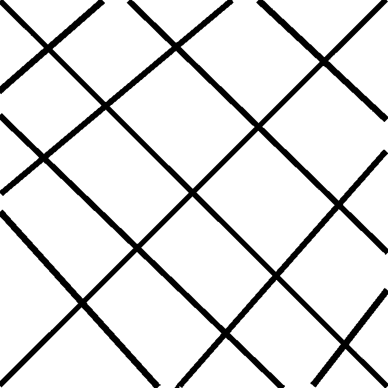

# Travaux pratiques : séance 1

Nous utiliserons le langage Python (version 3) ainsi que la librairie `scikit-image` :

https://scikit-image.org/

## Structures de données

Une image est codée par un tableau `numpy` ayant un type donné.

Un élément structurant sera codé dans un tableau `numpy` où la valeur `1` (resp. `0`) indique que le point correspondant appartient (resp. n'appartient pas) à l'élément structurant.

Voir des exemples : https://scikit-image.org/docs/dev/auto_examples/numpy_operations/plot_structuring_elements.html?highlight=structuring+element

## Opérateurs de base 

1. Implémenter en Python les opérateurs de base de morphologie mathématique : érosion, dilatation, ouverture, fermeture sans s'appuyer sur les fonctions correspondantes de `scikit-image`.

2. Vérifier la cohérence de votre implémentation en la comparant avec les fonctions de `scikit-image`.

## Filtrage morphologique

A l'aide d'un filtre morphologique, supprimer les lignes de l'image de gauche afin d'obtenir l'image de droite :

 
 

