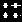
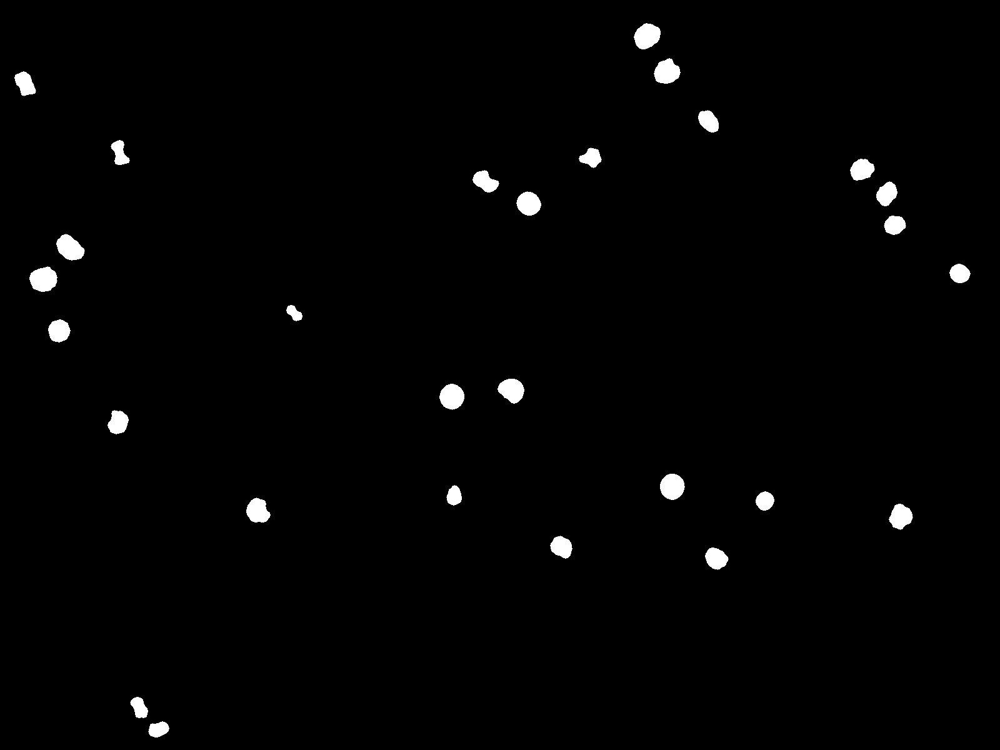
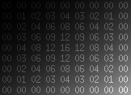

# Travaux pratiques : séance 2

## Opérateurs dérivés

1. Implémenter en Python les opérateurs suivants : 

 * transformée en tout-ou-rien binaire (*hit-or-miss transform* ou HMT)
 * ouverture annulaire
 * chapeau haut-de-forme clair et sombre (*white top-hat* / *black top-hat*)
 * gradient morphologique, interne et externe

2. Vérifier la cohérence de vos fonctions en les comparant avec les fonctions équivalentes du package `morphology`  de `scikit-image`.

## Applications

### Détection de forme

Dans l'image binaire ci-dessous, utiliser un opérateur pour conserver uniquement les deux objets en haut à gauche et en bas en droite.

 

### Amas d'objets

 Dans l'image ci-dessous conserver les amas d'objets, en gardant uniquement les points  situés à une distance de 50 pixels (environ) d'un autre point.
 

### Correction d'illumination

Le but est d'isoler les chiffres de l'image ci-dessous. 
 

La démarche proposée est la suivante :
1. Seuiller l'image. Expliquer pourquoi, quel que soit le choix du seuil, le résultat ne sera pas satisfaisant.
2. Supprimer les chiffres de l'image à l'aide d'une opération morphologique.
3. En utilisant l'image obtenue, corriger l'illumination de l'image originale.
4. Appliquer un seuillage global sur l'image permettant de conserver uniquement les chiffres (sans structures résiduelles) 

### Rayures

Trouver un opérateur permettant de supprimer les rayures noires dans cette image :
 

