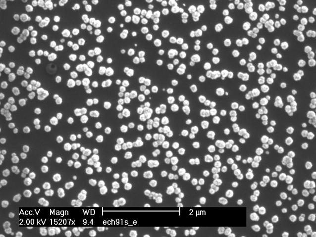
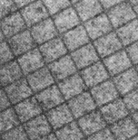

# Travaux pratiques : séance 3

## Granulométries

### Grains

Dans l'image  ci-dessous, calculer et afficher la courbe granulométrique ainsi que le pattern spectrum correspondant à une famille d'éléments structurants de type disque de rayons croissants.
Vous comparerez l'approche binaire (qui nécessite de seuiller d'abord l'image) puis l'approche en niveaux de gris.

En déduire le rayon des objets majoritaires dans l'image

 

### Lignes orientées

 Dans l'image ci-dessous, déterminer et implémenter une stratégie pour détecter et afficher les deux orientations principales des lignes présentes dans l'image.

 

